# git的使用

## 1.git的安装

sudo apt update

使用库安装：sudo apt-get install git

测试：git --version

## 2.git概念和工作流程

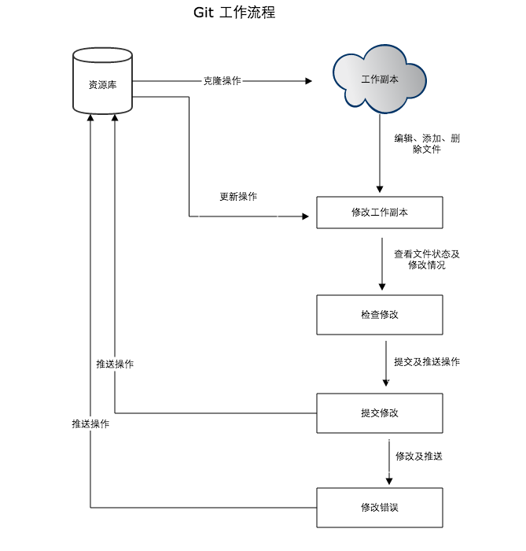

概念：

- **工作区：**就是你在电脑里能看到的目录。
- **暂存区：**英文叫 stage 或 index。一般存放在  .git 目录下的 index 文件（.git/index）中，所以我们把暂存区有时也叫作索引（index）。
- **版本库：**工作区有一个隐藏目录 .git，这个不算工作区，而是 Git 的版本库。
- 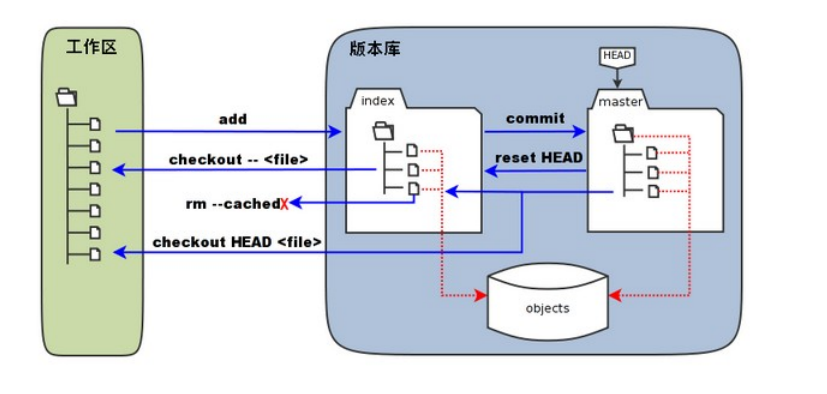

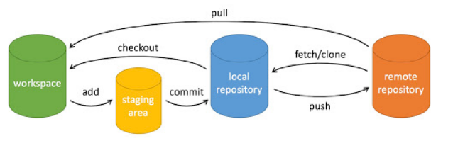

## 3.git常用命令

1）git项目

新建一个目录，在此目录下执行：git init 

执行后，会创建一个隐藏的.git目录：

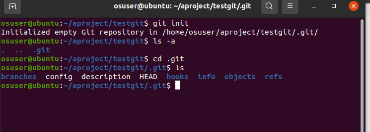

2)add

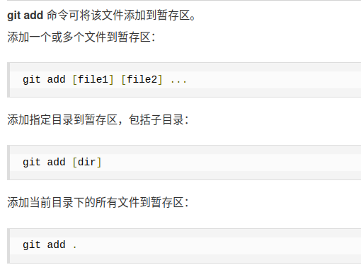

3)commit

提交文件到本地库。

提交到所有在staging area 中的文件到registory：

git commit -m [message]

message是备注

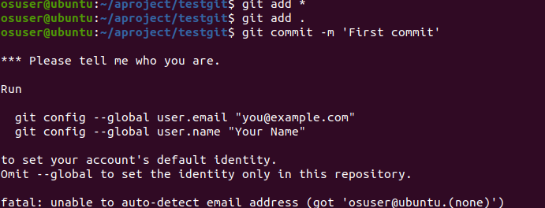

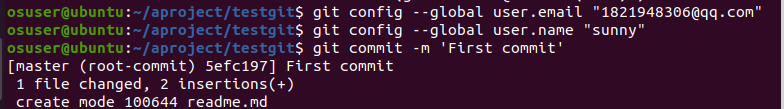

4)push

上传远程代码到远程仓库并合并。

前提：远程有仓库。

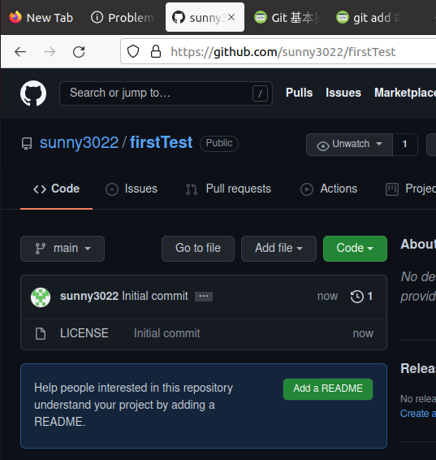

url栏里就是远程仓库地址。

先添加远程仓库

git remote add 别名 远程仓库url

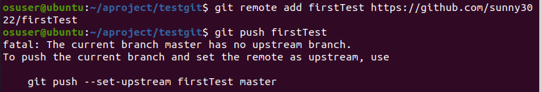

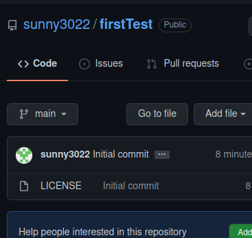

错误的原因是没有指定的远程的branch，需要指定为master。

注意：github页面将master分支名改成了“main”,但push时还需要用master,master对应web页面上的main。

push时命令正确，认证失败：

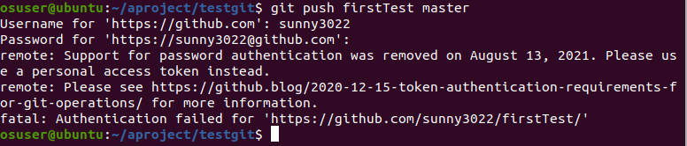

获取token的方法：

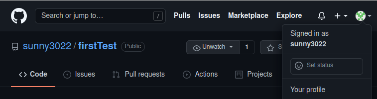

点击右上角代表自己的图标，选择settings

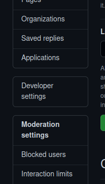

选择Developer settings

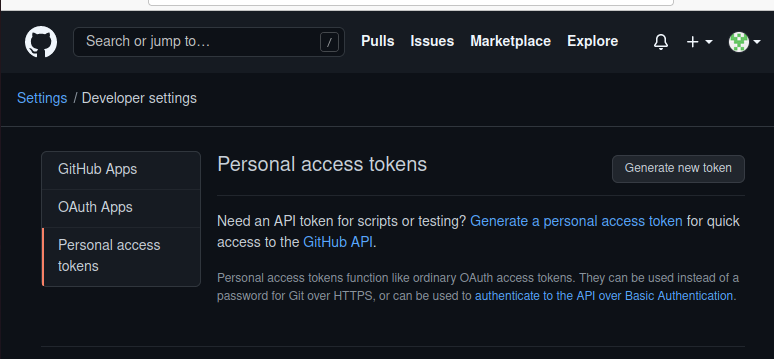

点击右面蓝色

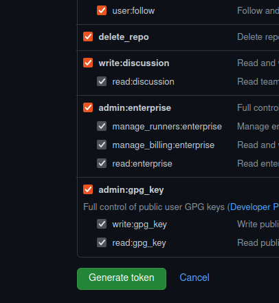

关闭页面之前，拷贝token，当作密码

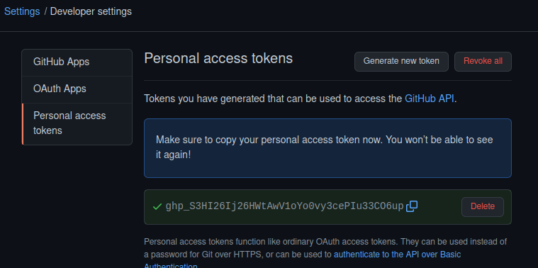

5)clone 

将远程仓库clone到本地：

git clone 远程仓库 url

clone后的操作步骤：

（1）修改文件

（2）add

（3）commit

(4) 远程同步

分支问题：从本地创建的项目，主分支是master，从远程开始，主分支是main

a）添加远程仓库

git remote add 别名 远程仓库 url

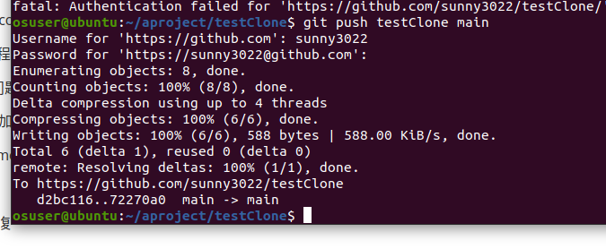

6)diff

查看工作区文件和staging area 文件的区别。

7）查看提交历史

git log

8）恢复reset

 git reset --hard HEAD^1

回退到上一个版本，--hard直接修改工作区文件内容。

## 4.在vscode中使用git

1)用命令行进行git初始化

在vscode 打开项目之前，已经执行了：git init, git add

在此目录下打开，可以直接用vscode的版本管理。

2)用vscode进行git初始化
